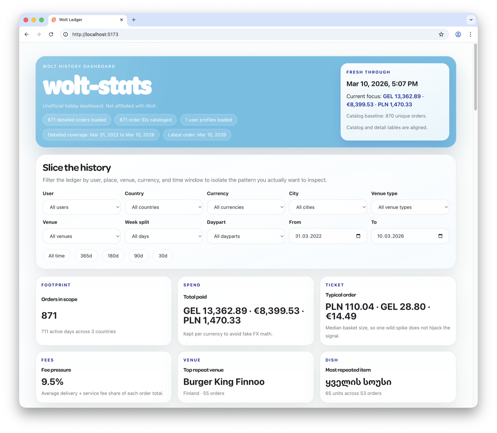
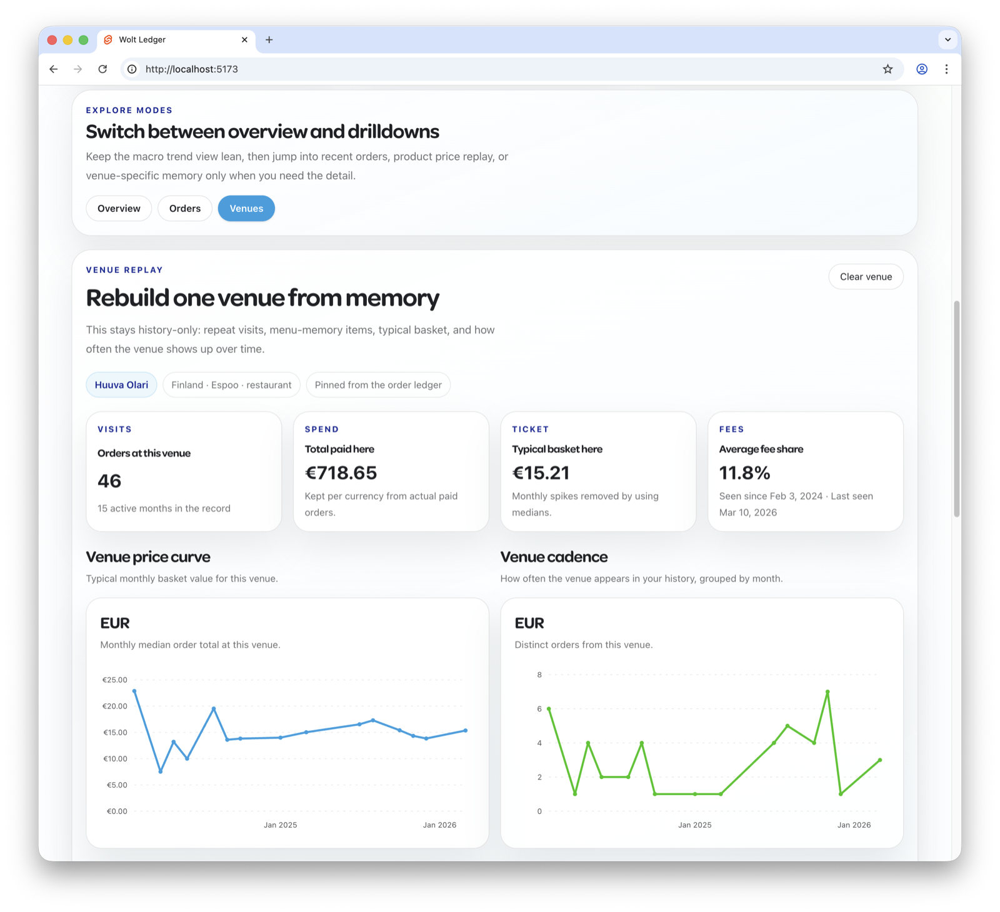
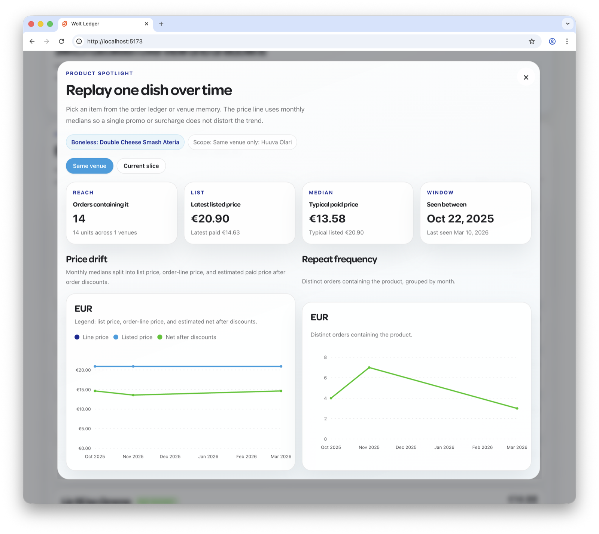

# wolt-stats

Unofficial hobby dashboard for exploring Wolt order history. Not affiliated with Wolt.

Live demo: https://mekedron.github.io/wolt-stats/

## Use this dashboard through [`wolt-cli`](https://github.com/mekedron/wolt-cli)

This dashboard is **fully integrated** with its companion project
**[wolt-cli](https://github.com/mekedron/wolt-cli)**, and that is the
recommended way to try it and see your own Wolt statistics.

Just install `wolt-cli` and run:

```bash
wolt stats
```

It downloads a pre-built bundle of this dashboard, syncs your order
history into a local SQLite database, and opens everything in your
browser — no Node.js setup needed.

**Heads up:** the **initial** order sync can take a long time — easily
**an hour or more** — because Wolt's API has very strict rate limits.
Subsequent runs are incremental and much faster.

| Primary                                                                      | Secondary                                                                        | Tertiary                                                                       |
| ---------------------------------------------------------------------------- | -------------------------------------------------------------------------------- | ------------------------------------------------------------------------------ |
|  |  |  |

## What It Does

- Syncs your Wolt order history into a local SQLite database
- Keeps reruns cheap by syncing incrementally by default
- Lets you filter by user, country, city, venue, venue type, currency, day split, and date range
- Shows spending, order cadence, fee pressure, venue patterns, and dish price trends
- Supports multiple users in the same database

## Dependencies

- Node.js 20+
- npm
- `wolt-cli`

Install `wolt-cli`:

```bash
brew tap mekedron/tap
brew install wolt-cli
```

Check that it works:

```bash
wolt --help
```

## Install

```bash
npm install
```

## Sync Your Data

> Tip: if you just want to view the dashboard and you already have
> [`wolt-cli`](https://github.com/mekedron/wolt-cli) installed, run
> `wolt stats` instead. It downloads a pre-built bundle from this repo's
> GitHub Releases, syncs your history into SQLite in Go (no Node.js
> needed at runtime), serves the dashboard at `http://127.0.0.1:5173`,
> and opens the browser. The Node sync below is the reference
> implementation kept for development on this repo.

The sync writes to `static/data/wolt-history.sqlite`.

```bash
./scripts/sync-wolt-history.sh \
  --userEmail you@example.com \
  --expectedOrderCount 870
```

Useful variants:

```bash
./scripts/sync-wolt-history.sh --help
./scripts/sync-wolt-history.sh --userEmail you@example.com --expectedOrderCount 870
./scripts/sync-wolt-history.sh --userEmail you@example.com --expectedOrderCount 870 --full
```

Notes:

- normal runs are incremental
- `--full` forces a full history rescan
- the database file is git-ignored and should stay private

## Generate Demo Data

Create a separate one-year fake database for previews:

```bash
npm run db:demo
```

That command:

- keeps your real sync database at `static/data/wolt-history.sqlite`
- writes a committed fake preview database to `static/data/wolt-history-demo.sqlite`
- makes an ignored backup copy of the live DB before generating demo data
- uses a stable demo window ending on `2026-03-10` unless you override `--endDate`

Build the app against the fake preview database:

```bash
npm run build:demo
```

For GitHub Pages project-site builds with the fake database:

```bash
npm run build:pages:demo
```

That demo build stages only the fake database into the public bundle, so your real
`wolt-history.sqlite` file and local backups are not copied into `build/`.

The GitHub Actions pipeline regenerates this demo database, checks that the committed
sample stays in sync with the generator, runs the full validation gate on pull
requests, and deploys the demo build to GitHub Pages when you push a semantic
version tag like `v0.1.0`.

## Run Locally

```bash
npm run dev
```

Open `http://localhost:5173`.

## Validate

```bash
npm run validate
```

## Build Static Output

```bash
npm run build
```

For GitHub Pages project-site builds:

```bash
npm run build:pages
```
